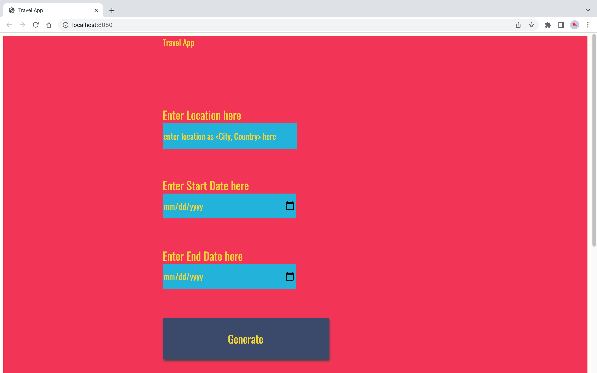
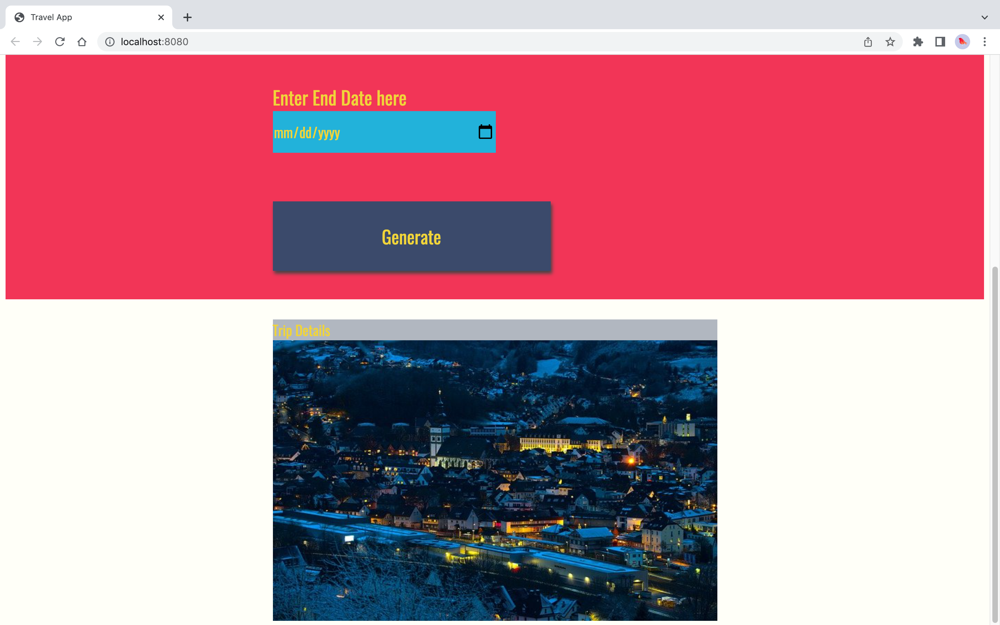
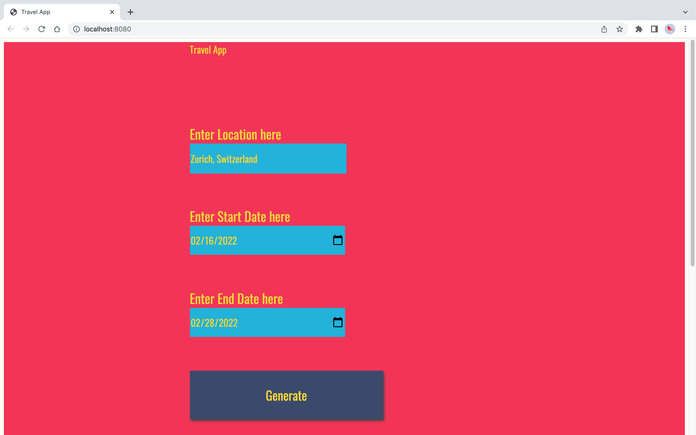
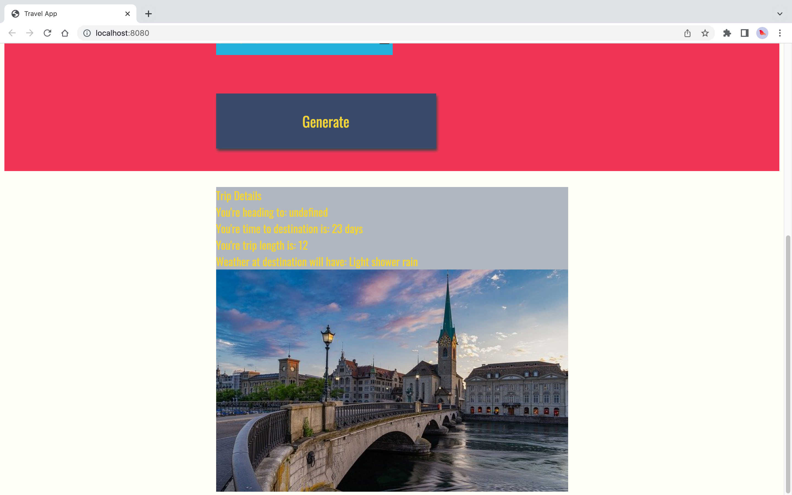
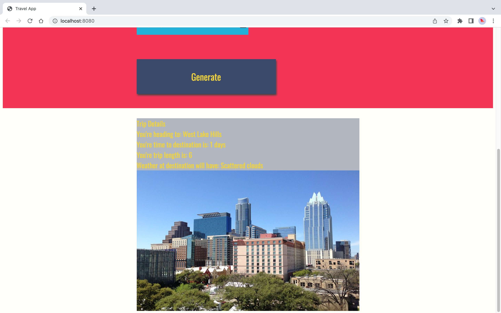

# capstone-travel-app

- Build a Travel Website that takes in user's travel destination and returns useful trip information like weather upon arrival. Presented trip information was extracted from Geonames, WeatherBit and Pixabay APIs.

## Instructions

- Clone project directory. Install everything via the commands below:

`> cd <project directory>`

`> npm install.`

## To run project
1. Open a terminal and go to project directory.
2. In terminal window: Build the code `> npm run build-prod`
4. In terminal window: Run the Dev Server `> npm run build-dev`; this will automatically pop open `http://localhost:8080`
5. Type a location in the location box, select dates of your trip and click on generate.
6. Days to trip, Length of trip and Destination photo appear below the generate button.

## Project Extension
1. Trip End date was added.
2. Length of trip is displayed.
3. Obscure location cases were handled: Pull in an image for the country from PixabayAPI when the entered location brings up no results.

# Screenshots

